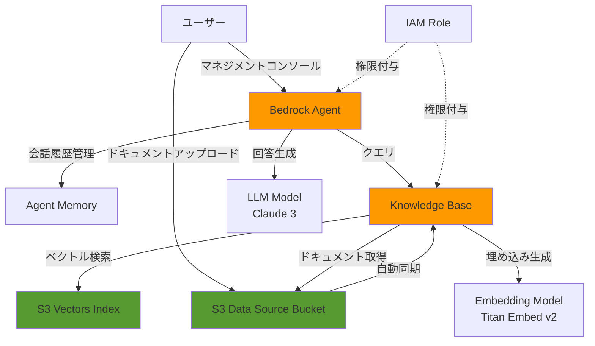
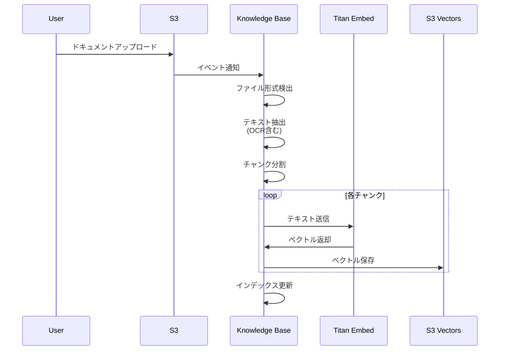
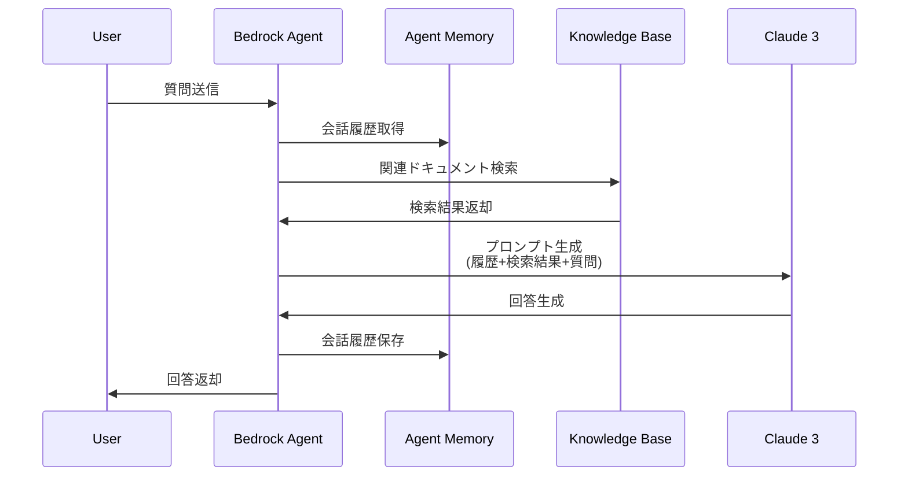

# 設計書

## 概要

本設計書は、AWS Bedrock Knowledge BaseとBedrock Agentを活用したRAGシステムのインフラストラクチャ設計を定義します。システムは、Terraformを使用してIaCとして管理され、多様な形式のドキュメントをサポートし、会話履歴を保持した自然な対話を実現します。

### 設計目標

- Terraformによる完全なインフラストラクチャコード化
- 多様なドキュメント形式（テキスト、CSV、Office、PDF、スキャンPDF）のサポート
- Bedrock Agentによる会話履歴の自動管理
- セキュアなアクセス制御（最小権限の原則）
- 試作環境向けの簡単なクリーンアップ機能

## アーキテクチャ

### システム構成図



### コンポーネント概要

1. **S3 Data Source Bucket**: ソースドキュメントを保存
2. **S3 Vectors**: ベクトル埋め込みを保存・検索
3. **Knowledge Base**: ドキュメントのベクトル化と検索を管理
4. **Bedrock Agent**: 会話履歴を保持し、Knowledge Baseと連携して回答を生成
5. **IAM Role**: 各サービスに必要最小限の権限を付与

## コンポーネントと インターフェース

### 1. S3 Data Source Bucket

#### 目的
多様な形式のソースドキュメントを安全に保存し、Knowledge Baseへの自動同期を実現します。

#### 設定

- **バケット名**: `{project_name}-rag-data-source-{account_id}`
- **バージョニング**: 有効
- **暗号化**: AES256サーバーサイド暗号化
- **パブリックアクセス**: 完全ブロック
- **force_destroy**: 有効（試作環境向け）

#### サポートファイル形式

| カテゴリ | 形式 | 拡張子 | 処理方法 |
|---------|------|--------|---------|
| テキスト | プレーンテキスト | .txt | 直接読み込み（文字コード自動検出） |
| CSV | カンマ区切り | .csv | 構造化データとして解析 |
| Office | Excel | .xlsx, .xls | テキスト抽出 |
| Office | Word | .docx, .doc | テキスト抽出 |
| Office | PowerPoint | .pptx, .ppt | スライドテキスト抽出 |
| PDF | テキストPDF | .pdf | テキスト抽出 |
| PDF | スキャンPDF | .pdf | OCR処理後テキスト抽出 |

### 2. S3 Vectors Index

#### 目的
ドキュメントのベクトル埋め込みを効率的に保存・検索します。

#### 設定

- **Vector Bucket名**: `{project_name}-rag-vectors`
- **Index名**: `{project_name}-rag-index`
- **次元数**: 1024（Titan Embed Text v2に対応）
- **データ型**: float32
- **距離メトリック**: euclidean
- **force_destroy**: 有効（試作環境向け）

#### ベクトル検索フロー

1. ユーザークエリをTitan Embed Text v2でベクトル化
2. S3 Vectorsインデックスで類似ベクトルを検索
3. 上位K件の関連ドキュメントを取得
4. ドキュメントをコンテキストとしてLLMに渡す

### 3. Knowledge Base

#### 目的
ドキュメントの自動ベクトル化、保存、検索を統合管理します。

#### 設定

- **名前**: `{project_name}-rag-kb`
- **タイプ**: VECTOR
- **埋め込みモデル**: amazon.titan-embed-text-v2:0
- **埋め込み次元**: 1024
- **埋め込みデータ型**: FLOAT32
- **ストレージ**: S3_VECTORS

#### Data Source設定

- **名前**: `{project_name}-rag-data-source`
- **タイプ**: S3
- **バケット**: S3 Data Source Bucket
- **同期**: 自動（S3イベント通知）

#### ドキュメント処理パイプライン



### 4. Bedrock Agent

#### 目的
Knowledge Baseと統合し、会話履歴を保持しながら自然な対話を実現します。

#### 設定

- **名前**: `{project_name}-rag-agent`
- **LLMモデル**: anthropic.claude-3-sonnet-20240229-v1:0（推奨）
- **インストラクション**: エージェントの振る舞いを定義
- **Knowledge Base統合**: 有効
- **会話履歴**: 自動管理（Bedrock Agent機能）

#### Agent Alias

- **名前**: `prod`
- **説明**: 本番用エイリアス
- **バージョン**: DRAFT（試作環境）

#### エージェントインストラクション例

```
あなたは、ナレッジベースに保存されたドキュメントを参照して質問に回答するアシスタントです。

以下のルールに従ってください：
1. ナレッジベースから関連情報を検索して回答してください
2. 情報が見つからない場合は、正直にその旨を伝えてください
3. 会話の文脈を考慮して、自然な対話を心がけてください
4. 回答には、参照したドキュメントの情報源を含めてください
```

#### 会話フロー



### 5. IAM Role

#### 目的
最小権限の原則に基づき、各サービスに必要な権限のみを付与します。

#### Knowledge Base用IAMロール

**ロール名**: `{project_name}-rag-kb-role`

**信頼ポリシー**:
- プリンシパル: bedrock.amazonaws.com
- 条件: 同一アカウント内のKnowledge Baseリソースのみ

**権限ポリシー**:
1. Bedrock埋め込みモデル呼び出し
   - アクション: `bedrock:InvokeModel`
   - リソース: `arn:aws:bedrock:*::foundation-model/amazon.titan-embed-text-v2:0`

2. S3 Vectors操作
   - アクション: `s3vectors:GetIndex`, `s3vectors:QueryVectors`, `s3vectors:PutVectors`, `s3vectors:GetVectors`, `s3vectors:DeleteVectors`
   - リソース: 指定されたS3 Vectorsインデックス

3. S3データソース読み取り
   - アクション: `s3:GetObject`, `s3:ListBucket`
   - リソース: 指定されたData Source Bucket

#### Bedrock Agent用IAMロール

**ロール名**: `{project_name}-rag-agent-role`

**信頼ポリシー**:
- プリンシパル: bedrock.amazonaws.com
- 条件: 同一アカウント内のAgentリソースのみ

**権限ポリシー**:
1. Bedrock LLMモデル呼び出し
   - アクション: `bedrock:InvokeModel`
   - リソース: `arn:aws:bedrock:*::foundation-model/anthropic.claude-3-*`

2. Knowledge Base操作
   - アクション: `bedrock:Retrieve`, `bedrock:RetrieveAndGenerate`
   - リソース: 指定されたKnowledge Base

## データモデル

### ドキュメントメタデータ

Knowledge Baseに保存される各ドキュメントチャンクには、以下のメタデータが付与されます：

```json
{
  "documentId": "unique-document-id",
  "chunkId": "chunk-sequence-number",
  "sourceUri": "s3://bucket-name/path/to/document.pdf",
  "fileName": "document.pdf",
  "fileType": "application/pdf",
  "uploadedAt": "2024-01-01T00:00:00Z",
  "chunkText": "ドキュメントの一部テキスト...",
  "vectorEmbedding": [0.123, 0.456, ...],
  "metadata": {
    "pageNumber": 1,
    "section": "Introduction"
  }
}
```

### 会話セッション

Bedrock Agentが管理する会話セッションの構造：

```json
{
  "sessionId": "unique-session-id",
  "agentId": "agent-id",
  "agentAliasId": "alias-id",
  "conversationHistory": [
    {
      "role": "user",
      "content": "ユーザーの質問",
      "timestamp": "2024-01-01T00:00:00Z"
    },
    {
      "role": "assistant",
      "content": "エージェントの回答",
      "timestamp": "2024-01-01T00:00:05Z",
      "citations": [
        {
          "documentId": "doc-id",
          "excerpt": "引用テキスト"
        }
      ]
    }
  ]
}
```

## エラーハンドリング

### ドキュメント処理エラー

| エラーケース | 処理方法 |
|------------|---------|
| サポート外のファイル形式 | エラーログ記録、処理スキップ |
| 文字コード検出失敗 | UTF-8でリトライ、失敗時はスキップ |
| OCR処理失敗 | エラーログ記録、処理スキップ |
| ファイルサイズ超過 | エラーログ記録、処理スキップ |
| 破損ファイル | エラーログ記録、処理スキップ |

### Knowledge Base検索エラー

| エラーケース | 処理方法 |
|------------|---------|
| 検索結果0件 | エージェントが「情報が見つかりません」と回答 |
| タイムアウト | リトライ（最大3回） |
| API制限超過 | 指数バックオフでリトライ |

### Agent実行エラー

| エラーケース | 処理方法 |
|------------|---------|
| LLMモデル呼び出し失敗 | リトライ（最大3回） |
| Knowledge Base接続失敗 | エラーメッセージ返却 |
| セッション期限切れ | 新規セッション作成 |

## テスト戦略

### インフラストラクチャテスト

#### 1. Terraform検証

- **terraform validate**: 構文チェック
- **terraform plan**: 変更内容の確認
- **terraform apply**: リソース作成の実行

#### 2. リソース作成確認

各リソースが正しく作成されることを確認：

```bash
# S3バケット確認
aws s3 ls | grep rag-data-source
aws s3 ls | grep rag-vectors

# Knowledge Base確認
aws bedrock-agent list-knowledge-bases

# Agent確認
aws bedrock-agent list-agents

# IAMロール確認
aws iam get-role --role-name {project_name}-rag-kb-role
aws iam get-role --role-name {project_name}-rag-agent-role
```

### 機能テスト

#### 1. ドキュメントアップロードテスト

各ファイル形式のサンプルをアップロードし、正しく処理されることを確認：

- テキストファイル（UTF-8、Shift-JIS）
- CSVファイル
- Excelファイル（.xlsx）
- Wordファイル（.docx）
- PowerPointファイル（.pptx）
- テキストPDF
- スキャンPDF

#### 2. ベクトル検索テスト

Knowledge Baseに対してクエリを実行し、関連ドキュメントが取得できることを確認：

```bash
# Knowledge Base IDを取得
KB_ID=$(terraform output -raw knowledge_base_id)

# ベクトル検索テスト
aws bedrock-agent-runtime retrieve \
  --knowledge-base-id $KB_ID \
  --retrieval-query text="テストクエリ" \
  --region us-east-1

# 検索結果が返却されることを確認
# retrievalResults配列に結果が含まれていればOK
```

#### 3. Agent会話テスト

Bedrock Agentとの対話をテストし、会話履歴が保持されることを確認：

```bash
# Agent IDとAlias IDを取得
AGENT_ID=$(terraform output -raw agent_id)
AGENT_ALIAS_ID=$(terraform output -raw agent_alias_id)
SESSION_ID="test-session-$(date +%s)"

# 1回目の質問
aws bedrock-agent-runtime invoke-agent \
  --agent-id $AGENT_ID \
  --agent-alias-id $AGENT_ALIAS_ID \
  --session-id $SESSION_ID \
  --input-text "最初の質問" \
  --region us-east-1 \
  output1.txt

# 2回目の質問（文脈を参照）
aws bedrock-agent-runtime invoke-agent \
  --agent-id $AGENT_ID \
  --agent-alias-id $AGENT_ALIAS_ID \
  --session-id $SESSION_ID \
  --input-text "それについてもっと詳しく教えて" \
  --region us-east-1 \
  output2.txt

# 会話履歴が保持され、文脈を理解した回答が返ることを確認
cat output1.txt
cat output2.txt
```

**マネジメントコンソールでのテスト（推奨）**:

1. AWSコンソールでBedrock > Agents を開く
2. 作成されたAgentを選択
3. 「Test」ボタンをクリック
4. チャット画面で質問を入力
5. 会話を続けて、文脈が保持されることを確認

### セキュリティテスト

#### 1. IAM権限テスト

- 最小権限の原則が守られていることを確認
- 不要な権限が付与されていないことを確認

#### 2. S3アクセステスト

- パブリックアクセスがブロックされていることを確認
- 暗号化が有効であることを確認

## デプロイメント

### 前提条件

1. AWS CLIがインストールされ、認証情報が設定されていること
2. Terraformがインストールされていること（v1.0以上推奨）
3. 必要なBedrockモデルへのアクセスが有効化されていること
   - Amazon Titan Embed Text v2
   - Anthropic Claude 3 Sonnet

### デプロイ手順

#### 1. Terraformの初期化

```bash
cd infra/iac/rag
terraform init
```

#### 2. 変数の設定

`terraform.tfvars`ファイルを作成：

```hcl
aws_region   = "us-east-1"
project_name = "yui-lab"
```

#### 3. デプロイ計画の確認

```bash
terraform plan
```

#### 4. リソースのデプロイ

```bash
terraform apply
```

#### 5. 出力値の確認

```bash
terraform output
```

### デプロイ後の設定

#### 1. Knowledge Baseの同期

初回デプロイ後、Data Sourceを手動で同期：

```bash
aws bedrock-agent start-ingestion-job \
  --knowledge-base-id <kb-id> \
  --data-source-id <ds-id>
```

#### 2. Agentのテスト

マネジメントコンソールからAgentをテスト：

1. Bedrock コンソールを開く
2. Agents > 作成されたAgent を選択
3. Test ボタンをクリック
4. テストクエリを入力して動作確認

## 監視とメンテナンス

### CloudWatch メトリクス

以下のメトリクスを監視：

- Knowledge Base
  - ドキュメント処理数
  - 検索クエリ数
  - エラー率

- Bedrock Agent
  - 会話セッション数
  - 平均応答時間
  - エラー率

### ログ

CloudWatch Logsに以下のログが記録されます：

- Knowledge Base処理ログ
- Agent実行ログ
- IAMアクセスログ（CloudTrail）

### メンテナンス作業

#### ドキュメントの更新

1. S3バケットにドキュメントをアップロード
2. 自動的にKnowledge Baseが同期
3. 必要に応じて手動同期を実行

#### Agentインストラクションの更新

1. Terraformコードでインストラクションを更新
2. `terraform apply`を実行
3. 新しいバージョンが作成される

#### リソースのクリーンアップ

試作環境のため、不要になったら簡単に削除可能：

```bash
terraform destroy
```

`force_destroy`が有効なため、S3バケット内のデータも含めて削除されます。
